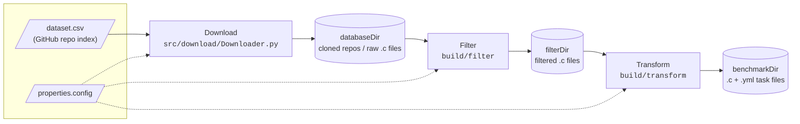
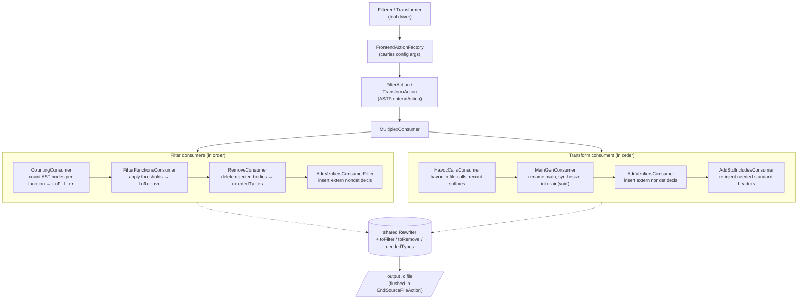

# ArgV C Transformer — Design

ArgV converts real-world C source files into [SV-Comp](https://sv-comp.sosy-lab.org/)-style
verification benchmarks. The pipeline has three stages — **Download**, **Filter**, and
**Transform** — each driven by the same INI config file (e.g. `properties.config`).

## Pipeline Overview

The `full` binary runs Filter then Transform in one invocation. All three binaries take the
config file path as their sole argument

## Stage Responsibilities

### 1. Download (`src/download/Downloader.py`)

Populates `databaseDir` with candidate C code from GitHub.

- Reads a CSV index of repositories (`csv` setting, default `dataset.csv`).
- Applies `[Downloading]` config criteria: `language`, `minRepoLoC`, `minNumStars`,
  and stops after `projectCount` repos.
- Checks each repo URL is still reachable, then shallow-clones (`--depth=1`) into
  `downloadDir`.
- Not part of the CMake build; invoked directly (`python3 src/download/Downloader.py
  properties.config`) or from the commented-out step in `run.sh`.

### 2. Filter (`src/filter/`, driver: `Filterer.cpp`)

Selects which functions in the downloaded C files are interesting enough to become
benchmarks, and strips the rest. **Removal means body-stripping, not deletion**: the
function's body `{ … }` is replaced with `;`, leaving a bare prototype so the
Transform step can still resolve its return type.

- Counts AST properties per function (loops, comparisons, if-statements, …).
- Applies `[Complexity Requirements]` min/max thresholds and `[Feature Requirements]`
  presence gates; functions that fail are removed. `main` is **not** exempt from these —
  a `main` with, say, zero `for`-loops is removed just like any other function if
  `ForLoops` has a nonzero minimum.
- **Parameter-type gate**: any function that survives the thresholds but has at least one
  parameter whose type is not a supported primitive (see *Supported Types* below) is also
  body-stripped. This prevents vestigial functions from appearing in the final benchmark —
  they would have bodies but never be called. `main` **is** exempt from this gate — its
  `argc`/`argv` params are handled specially by `MainGenConsumer` in the Transform stage.
- Applies `[File Requirements and Settings]` (e.g. `minFileLoC`, `useNonStdHeaders`,
  `keepCompilesOnly`).
- Injects `extern __VERIFIER_nondet_*` declarations for the types that removed
  functions leave behind.
- Writes the surviving, rewritten files to `filterDir`.

### 3. Transform (`src/transform/`, driver: `Transformer.cpp`)

Turns filtered files into self-contained, intraprocedural SV-Comp benchmarks.

- **Havoc calls** (`HavocCallsVisitor`): every call to a function declared *in this file*
  is replaced based on return type:
  - Primitive return → `__VERIFIER_nondet_<type>()`
  - Non-function-pointer return → `__havoc_block(128)` (malloc'd block filled via
    `__VERIFIER_nondet_memory`); `char *` returns use `__havoc_cstring(128)` (same, but
    null-terminated so string ops stay in bounds)
  - `void` return → call is dropped (the statement's semicolon stays, leaving an empty
    statement)
  - Aggregate return (struct, union) → left as-is (no expression-position nondet
    equivalent exists)
  - Library calls (C stdlib, system headers) and `__VERIFIER_*` calls are kept unchanged
  - Calls inside macro expansions are skipped (no rewritable source range)
- **Main generation** (`MainGenConsumer`): a pre-existing `main` is renamed to
  `original_main`; a fresh `int main(void)` is appended that calls every **defined**
  function (body-stripped prototypes are skipped via `isThisDeclarationADefinition`):
  - Functions with only primitive params → called with `__VERIFIER_nondet_*()` arguments
  - Variadic functions → skipped with a warning
  - `original_main(void)` → called with no arguments
  - `original_main(int argc, char **argv)` → called with a synthesized `argc`/`argv`:
    a nondet `argc` bounded to `[0, 7]` via `abort()`, a VLA of `__havoc_cstring(16)`
    entries, null-terminated (`argv[argc] = 0`) per the C standard
- **Verifier declarations** (`AddVerifiersConsumer`): `extern <type>
  __VERIFIER_nondet_<suffix>(void);` lines are inserted for every suffix used (skipping
  ones the Filter stage already injected). Helper definitions for `__havoc_block` and
  `__havoc_cstring` are emitted when those markers are present.
- **Standard-header injection** (`AddStdIncludesConsumer`): include stripping (below)
  also drops the project headers through which standard types like `size_t`, `bool`,
  `FILE`, or `uint32_t` were transitively available. This consumer walks the AST for
  used types, maps each to its standard header via
  `src/common/include/StdHeaders.hpp` (a type→header registry with categories for
  future logical-structure filtering), and re-injects any needed `#include <...>` not
  already present.
- **Post-processing** (`Transformer::transformFile`):
  - **Empty-harness discard**: if the generated `main` contains no function calls (every
    function was skipped), the output file is unconditionally deleted
  - **Compile check**: the output is compiled with `clang -fsyntax-only`;
    non-compiling benchmarks are deleted when `keepCompilesOnly` is set
  - **Preprocessing**: surviving benchmarks are preprocessed into a `.i` file with
    `gcc -E -P -std=gnu11` (the form SV-Comp consumes); on failure the `.c`/`.yml`/`.i`
    are removed
- Emits `.c` + `.yml` task files into `benchmarkDir`; `.set` files in
  `argc-benchmarks/` group `.yml` files into SV-Comp benchmark sets.
- **Crash isolation** (`Transformer::transformFileIsolated`): each file's transform runs
  in a forked child, so a segfault, OOM-kill, assertion, or hang on one pathological file
  cannot halt the whole batch. The parent enforces a per-file `fileTimeoutSecs` budget
  (default 60s), kills overruns, cleans up any partial output, and continues.

## Design Choices and Limitations

### Supported Types

Only C builtin primitives have `__VERIFIER_nondet_*` equivalents. The full set (defined in
`VerifierNames.hpp`):

`_Bool`, `char`, `signed char`, `unsigned char`, `short`, `unsigned short`, `int`,
`unsigned int`, `long`, `unsigned long`, `long long`, `unsigned long long`, `float`,
`double`

Types outside this set (pointers, structs, unions, enums, typedefs to non-builtins) are
**unsupported for parameter synthesis**. Functions with any unsupported parameter type
cannot be called in the generated harness and have their bodies stripped during filtering.

### Intraprocedural by Design

Each function body is made self-contained: calls to other functions *in the same file*
are replaced with nondeterministic values (havocked). This means the benchmark exercises
each function in isolation — interprocedural reasoning is not tested. Library calls
(C stdlib, system headers) are kept because they have well-known semantics that verifiers
model directly.

### Body-Stripping vs Deletion

Removed functions are body-stripped to bare prototypes (`void f(int x);`), not deleted
entirely. This is intentional: the Transform step's `HavocCallsVisitor` needs the
callee's declaration to resolve its return type when replacing calls. Without the
prototype, the return type would be unknown and the havoc replacement couldn't determine
which `__VERIFIER_nondet_*` variant to use.

### Main Handling

`main` receives special treatment throughout the pipeline:

- **Filter**: subject to the same complexity/feature thresholds as any other function — a
  `main` that doesn't meet them gets body-stripped too. It's exempt only from the
  parameter-type gate, so its `argc`/`argv` pointer params never trigger removal on their
  own.
- **Transform**: renamed to `original_main` and called from a synthesized `main(void)`.
  For `main(int, char**)`, the pointer params have a well-defined contract (unlike an
  arbitrary `void *`), so we synthesize a realistic `argc`/`argv` using havocked C strings
  rather than skipping the function.
- The `argc` bound (`0–7`) and `argv` string size (`16` bytes) are fixed constants — they
  keep the verifier's state space bounded but are not configurable.

### Pointer Returns in Havocking

When havocking a call that returns a pointer, a raw nondet pointer value cannot be used
(dereferencing an arbitrary address is undefined behavior). Instead, the replacement
allocates a real block via `malloc` and fills it with nondeterministic content
(`__VERIFIER_nondet_memory`). `char *` returns are null-terminated so that string
operations on the result stay in bounds. Function pointer returns are left as-is.

### Include Stripping

The Transform step removes all non-system `#include` directives. Functions declared in
project-local headers are havocked anyway, so the includes only leave unresolvable
references. Standard types that were reaching the file transitively through a stripped
project header are recovered by `AddStdIncludesConsumer` (see the Transform stage above).
Files that depend on *project* types or macros from a local header will still fail to
compile after stripping and are caught by `keepCompilesOnly`.

### Preprocessor-Gated Code

The pipeline only operates on the **active** preprocessed translation unit. Functions inside
inactive `#ifdef` blocks (e.g. `#ifdef REDIS_TEST`) are invisible to all AST passes —
they are neither counted, filtered, havocked, nor harnessed. They pass through unchanged
as raw text.

### Empty Benchmark Discard

A benchmark whose generated `main` calls no functions (because every function was
unsupported) is unconditionally deleted. This is a post-write text check coupled to
`MainGenConsumer`'s generated-main format string — it detects the exact verbatim empty
main `int main(void) {\n  return 0;\n}`.

### What Is Not Supported

- **Struct / union / enum parameters**: no `__VERIFIER_nondet_*` equivalent exists for
  aggregate types, so functions with these parameter types are body-stripped and not
  harnessed
- **Variadic functions** (e.g. `printf`-style): skipped with a warning; no way to
  synthesize a meaningful argument list
- **Aggregate return types**: calls returning structs/unions are left as-is (not havocked),
  since there is no expression-position nondet equivalent
- **Function pointer returns**: calls returning function pointers are left as-is
- **`envp` (third `main` parameter)**: `int main(int, char**, char**)` is not explicitly
  handled; only the first two parameters (`argc`, `argv`) are synthesized
- **Macro-expanded calls**: calls inside macro expansions have no rewritable source range
  and are skipped by the havoc pass
- **K&R-style (old-style) declarations**: the pipeline assumes ANSI-prototyped function
  declarations throughout (parameter typing, the filter's parameter-type gate, and
  `HavocCallsVisitor`'s callee resolution all read from `FunctionDecl::parameters()`).
  Old-style `int f(a, b) int a, b; { ... }` definitions are not explicitly detected or
  special-cased, and their behavior through the pipeline is untested
- **Typedef'd types**: a typedef to a supported builtin (e.g. `typedef int myint`) resolves
  correctly via `getAs<BuiltinType>()`, but a typedef to an unsupported type (e.g.
  `typedef struct foo bar`) is treated as unsupported

## Internal Structure: the Clang AST Pipeline Pattern

Filter and Transform share the same Clang tooling skeleton. Each tool wires a sequence of
AST consumers into a `MultiplexConsumer`; all consumers share one `Rewriter` and
communicate through shared state (`toFilter` map, `toRemove` vector, `neededTypes` set).
The Rewriter's edited buffer is flushed to the output file in `EndSourceFileAction`.

Verifier nondet naming and suffix→C-type mappings live in
`src/common/include/VerifierNames.hpp`, shared by both stages.

## Binaries

| Binary      | Source           | Job                                              |
|-------------|------------------|--------------------------------------------------|
| `filter`    | `src/filter/`    | Filter stage only                                 |
| `transform` | `src/transform/` | Transform stage only                              |
| `full`      | `src/full/`      | Filter then Transform in one run                  |
