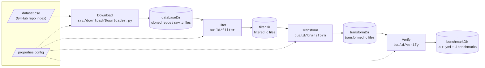
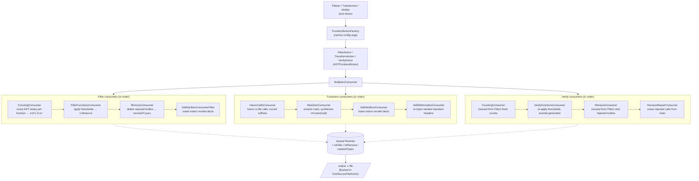

<!--
SPDX-FileCopyrightText: Copyright (C) 2026 The ARG-V Project

SPDX-License-Identifier: Apache-2.0
-->

# ArgV C Transformer — Design

ArgV converts real-world C source files into [SV-Comp](https://sv-comp.sosy-lab.org/)-style
verification benchmarks. The pipeline has four stages — **Download**, **Filter**,
**Transform**, and **Verify** — each driven by the same INI config file (e.g.
`properties.config`), parsed once by the shared `parsePipelineConfig`
(`src/common/include/ConfigParser.hpp`) so every stage sees identical thresholds.

## Pipeline Overview

The `argv-c` binary runs Filter, Transform, then Verify in one invocation, then
deletes the intermediate `-filtered`/`-transformed` directories once verify
finishes (unless the config explicitly names `filterDir`/`transformDir`,
which is taken as a request to keep them). All four C++ binaries take up to
two positional arguments — an input (directory or single `.c` file) and/or a
config file, in either order; a `-filtered`/`-transformed` suffix on the
input name is stripped when deriving default output names.

## Stage Responsibilities

### 1. Download (`src/download/Downloader.py`)

Populates `databaseDir` with candidate C code from GitHub.

- Reads a CSV index of repositories (`csv` setting, default `dataset.csv`).
- Applies `[Downloading]` config criteria: `language`, `minRepoLoC`, `minNumStars`,
  and stops after `projectCount` repos.
- Checks each repo URL is still reachable, then shallow-clones (`--depth=1`) into
  `databaseDir`.
- Not part of the CMake build; invoked directly (`python3 src/download/Downloader.py
  properties.config`).

### 2. Filter (`src/filter/`, driver: `Filterer.cpp`)

Selects which functions in the downloaded C files are interesting enough to become
benchmarks, and strips the rest. **Removal means body-stripping, not deletion**: the
function's body `{ … }` is replaced with `;`, leaving a bare prototype so the
Transform step can still resolve its return type.

- Counts AST properties per function (loops, comparisons, if-statements, …).
- Applies `[Complexity Requirements]` min/max thresholds and `[Feature Requirements]`
  presence gates; functions that fail are removed. `main` is **not** exempt from these —
  a `main` with, say, zero `for`-loops is removed just like any other function if
  `ForLoops` has a nonzero minimum.
- **Parameter-type gate**: any function that survives the thresholds but has at least one
  parameter whose type is not a supported primitive (see *Supported Types* below) is also
  body-stripped. This prevents vestigial functions from appearing in the final benchmark —
  they would have bodies but never be called. `main` **is** exempt from this gate — its
  `argc`/`argv` params are handled specially by `MainGenConsumer` in the Transform stage.
- Applies `[File Requirements and Settings]` (e.g. `minFileLoC`, `useNonStdHeaders`).
- Injects `extern __VERIFIER_nondet_*` declarations for the types that removed
  functions leave behind.
- Writes the surviving, rewritten files to `filterDir`.

### 3. Transform (`src/transform/`, driver: `Transformer.cpp`)

Turns filtered files into self-contained, intraprocedural benchmark sources. This stage
is purely source→source: it writes rewritten `.c` files to `transformDir` and leaves all
finalization (compile check, `.yml`, `.i`) to the Verify stage.

- **Havoc calls** (`HavocCallsVisitor`): every call to a function declared *in this file*
  is replaced based on return type:
  - Primitive return → `__VERIFIER_nondet_<type>()`
  - Non-function-pointer return → `__havoc_block(128)` (malloc'd block filled via
    `__VERIFIER_nondet_memory`); `char *` returns use `__havoc_cstring(128)` (same, but
    null-terminated so string ops stay in bounds)
  - `void` return → call is dropped (the statement's semicolon stays, leaving an empty
    statement)
  - Aggregate return (struct, union) → left as-is (no expression-position nondet
    equivalent exists)
  - Library calls (C stdlib, system headers) and `__VERIFIER_*` calls are kept unchanged
  - Calls inside macro expansions are skipped (no rewritable source range)
- **Main generation** (`MainGenConsumer`): a pre-existing `main` is renamed to
  `original_main`; a fresh `int main(void)` is appended that calls every **defined**
  function (body-stripped prototypes are skipped via `isThisDeclarationADefinition`):
  - Functions with only primitive params → called with `__VERIFIER_nondet_*()` arguments
  - Variadic functions → skipped with a warning
  - `original_main(void)` → called with no arguments
  - `original_main(int argc, char **argv)` → called with a synthesized `argc`/`argv`:
    a nondet `argc` bounded to `[0, 7]` via `abort()`, a VLA of `__havoc_cstring(16)`
    entries, null-terminated (`argv[argc] = 0`) per the C standard
- **Verifier declarations** (`AddVerifiersConsumer`): `extern <type>
  __VERIFIER_nondet_<suffix>(void);` lines are inserted for every suffix used (skipping
  ones the Filter stage already injected). Helper definitions for `__havoc_block` and
  `__havoc_cstring` are emitted when those markers are present.
- **Standard-header injection** (`AddStdIncludesConsumer`): include stripping (below)
  also drops the project headers through which standard types like `size_t`, `bool`,
  `FILE`, or `uint32_t` were transitively available. This consumer walks the AST for
  used types, maps each to its standard header via
  `src/common/include/StdHeaders.hpp` (a type→header registry with categories for
  future logical-structure filtering), and re-injects any needed `#include <...>` not
  already present.
- **Empty-harness discard** (`Transformer::transformFile`): if the generated `main`
  contains no function calls (every function was skipped), the output file is
  unconditionally deleted. This is an early string-match against `MainGenConsumer`'s
  verbatim empty-main format; the Verify stage repeats the check structurally after
  harness repair.
- Emits `.c` files into `transformDir`.
- **Crash isolation** (`Transformer::transformFileIsolated`): each file's transform runs
  in a forked child, so a segfault, OOM-kill, assertion, or hang on one pathological file
  cannot halt the whole batch. The parent enforces a per-file `fileTimeoutSecs` budget
  (default 60s), kills overruns, cleans up any partial output, and continues. (Verify
  does not fork — its input is the pipeline's own generated code.)

### 4. Verify (`src/verify/`, driver: `Verifier.cpp`)

Re-checks each transformed file against the *same* config thresholds the Filter applied,
repairs or discards degraded benchmarks, and finalizes survivors into `benchmarkDir`.

The stage exists because Transform's rewrites are text-only Rewriter edits — the AST the
Transform stage holds still reflects the *pre*-edit source, so only a fresh reparse can
see the post-transform shape. And that shape can differ materially: havocking drops void
calls and prunes control flow left empty by the drop, so a function can fall below
complexity thresholds it originally met.

Consumer chain (over a fresh AST of the finished, post-main-gen source):

1. `CountingConsumer` (reused from Filter) — fresh per-function counts.
2. `VerifyFunctionsConsumer` — re-applies `[Complexity Requirements]` /
   `[Feature Requirements]`. Exempts the generated artifacts: `main` and any
   `__VERIFIER_*`/`__havoc_*` definitions (`isVerifierGenerated` in
   `VerifierNames.hpp`). No parameter-type gate (params were vetted in Filter, and
   `original_main`'s `argc/argv` are legitimate). `__VERIFIER_nondet_*` calls are
   excluded from the `CallFunc` count (they replace real calls 1:1 and aren't
   interprocedural complexity).
3. `RemoveConsumer` (reused from Filter) — strips rejected bodies to `;`.
4. `HarnessRepairConsumer` — **repair policy**: a stripped function's call must also be
   removed from the generated `main`, or the harness calls a declared-but-undefined
   function (passes `-fsyntax-only`, unsound for termination). All harness calls are
   top-level statements of `main`, so repair only scans main's direct children, erasing
   calls to rejected functions and counting those that remain. Zero remaining harness
   calls → the benchmark is discarded.

The driver then finalizes each survivor:

- **Compile check**: `clang -fsyntax-only` (with `__VERIFIER_*` stubs prepended);
  failures are discarded when `keepCompilesOnly` is set (default true)
- **Task file**: `.yml` written via `selectProperties`, which receives the fresh
  per-function counts (the hook for future AST-driven property selection; currently a
  fixed `termination` + `no-overflow` set)
- **Preprocessing**: `clang -E -P -std=gnu11` produces the `.i` SV-Comp consumes; on
  failure the `.c`/`.yml` are removed

## Design Choices and Limitations

### Supported Types

Only C builtin primitives have `__VERIFIER_nondet_*` equivalents. The full set (defined in
`VerifierNames.hpp`):

`_Bool`, `char`, `signed char`, `unsigned char`, `short`, `unsigned short`, `int`,
`unsigned int`, `long`, `unsigned long`, `long long`, `unsigned long long`, `float`,
`double`

Types outside this set (pointers, structs, unions, enums, typedefs to non-builtins) are
**unsupported for parameter synthesis**. Functions with any unsupported parameter type
cannot be called in the generated harness and have their bodies stripped during filtering.

### Intraprocedural by Design

Each function body is made self-contained: calls to other functions *in the same file*
are replaced with nondeterministic values (havocked). This means the benchmark exercises
each function in isolation — interprocedural reasoning is not tested. Library calls
(C stdlib, system headers) are kept because they have well-known semantics that verifiers
model directly.

### Body-Stripping vs Deletion

Removed functions are body-stripped to bare prototypes (`void f(int x);`), not deleted
entirely. This is intentional: the Transform step's `HavocCallsVisitor` needs the
callee's declaration to resolve its return type when replacing calls. Without the
prototype, the return type would be unknown and the havoc replacement couldn't determine
which `__VERIFIER_nondet_*` variant to use.

### Main Handling

`main` receives special treatment throughout the pipeline:

- **Filter**: subject to the same complexity/feature thresholds as any other function — a
  `main` that doesn't meet them gets body-stripped too. It's exempt only from the
  parameter-type gate, so its `argc`/`argv` pointer params never trigger removal on their
  own.
- **Transform**: renamed to `original_main` and called from a synthesized `main(void)`.
  For `main(int, char**)`, the pointer params have a well-defined contract (unlike an
  arbitrary `void *`), so we synthesize a realistic `argc`/`argv` using havocked C strings
  rather than skipping the function.
- **Verify**: the *generated* `main` is exempt from the threshold re-check (it's harness
  scaffolding, not benchmark content); `original_main` is subject to thresholds like any
  function, but no parameter gate is re-applied, so its `argc`/`argv` never trigger
  removal.
- The `argc` bound (`0–7`) and `argv` string size (`16` bytes) are fixed constants — they
  keep the verifier's state space bounded but are not configurable.

### Pointer Returns in Havocking

When havocking a call that returns a pointer, a raw nondet pointer value cannot be used
(dereferencing an arbitrary address is undefined behavior). Instead, the replacement
allocates a real block via `malloc` and fills it with nondeterministic content
(`__VERIFIER_nondet_memory`). `char *` returns are null-terminated so that string
operations on the result stay in bounds. Function pointer returns are left as-is.

### Include Stripping

The Transform step removes all non-system `#include` directives. Functions declared in
project-local headers are havocked anyway, so the includes only leave unresolvable
references. Standard types that were reaching the file transitively through a stripped
project header are recovered by `AddStdIncludesConsumer` (see the Transform stage above).
Files that depend on *project* types or macros from a local header will still fail to
compile after stripping and are caught by the Verify stage's `keepCompilesOnly` compile
check.

### Function-Name Map Lookups in `CountingVisitor`

`CountingVisitor`'s `Visit*` methods resolve the enclosing function name for
each AST node (via `getStmtParentFuncName`/`getDeclParentFuncName`) and use it
to key into the `_allFunctions` map, falling through to `.at()` — an unknown
name throws `std::out_of_range` and aborts that file's processing rather than
silently misattributing counts. An earlier version routed unknown names to the
always-present `"Program"` bucket instead of using `.at()` directly, on the
theory that a node could pass its own `isInMainFile` check while its resolved
enclosing function came from a macro expansion or an unresolved header. That
theory doesn't hold up: unresolved local headers (the Filter step has no
project-local include path — see *Include Stripping*) fail non-fatally and
their macros are simply never defined, so nothing can expand from them; and
Clang's error-recovery paths (implicit-int fallback, hard parse bail-outs)
were verified empirically to never produce the mismatch — tested against 5,134
real-world files plus adversarial cases (unresolved-header return types,
unresolved-header macros, broken declarators, macro-synthesized functions,
`#line`-split declarations) with zero fallback triggers. If `.at()` ever does
throw in practice, treat it as a real bug to investigate (a genuinely new
AST shape falling through the traversal-order assumption), not something to
paper over with a silent fallback again.

### Preprocessor-Gated Code

The pipeline only operates on the **active** preprocessed translation unit. Functions inside
inactive `#ifdef` blocks (e.g. `#ifdef REDIS_TEST`) are invisible to all AST passes —
they are neither counted, filtered, havocked, nor harnessed. They pass through unchanged
as raw text.

### Empty Benchmark Discard

A benchmark whose generated `main` calls no functions is unconditionally deleted. This
happens at two points: Transform does an early post-write text check coupled to
`MainGenConsumer`'s generated-main format string (the exact verbatim empty main
`int main(void) {\n  return 0;\n}`), and Verify does a structural recount after harness
repair — the text check can't work there, because repaired calls leave `;` statements
behind, so `HarnessRepairConsumer` counts the surviving harness calls instead and the
benchmark is discarded when that count is zero.

### What Is Not Supported

- **Struct / union / enum parameters**: no `__VERIFIER_nondet_*` equivalent exists for
  aggregate types, so functions with these parameter types are body-stripped and not
  harnessed
- **Variadic functions** (e.g. `printf`-style): skipped with a warning; no way to
  synthesize a meaningful argument list
- **Aggregate return types**: calls returning structs/unions are left as-is (not havocked),
  since there is no expression-position nondet equivalent
- **Function pointer returns**: calls returning function pointers are left as-is
- **`envp` (third `main` parameter)**: `int main(int, char**, char**)` is not explicitly
  handled; only the first two parameters (`argc`, `argv`) are synthesized
- **Macro-expanded calls**: calls inside macro expansions have no rewritable source range
  and are skipped by the havoc pass
- **K&R-style (old-style) declarations**: the pipeline assumes ANSI-prototyped function
  declarations throughout (parameter typing, the filter's parameter-type gate, and
  `HavocCallsVisitor`'s callee resolution all read from `FunctionDecl::parameters()`).
  Old-style `int f(a, b) int a, b; { ... }` definitions are not explicitly detected or
  special-cased, and their behavior through the pipeline is untested
- **Typedef'd types**: a typedef to a supported builtin (e.g. `typedef int myint`) resolves
  correctly via `getAs<BuiltinType>()`, but a typedef to an unsupported type (e.g.
  `typedef struct foo bar`) is treated as unsupported

## Downstream Verifier Frontend Compatibility

Benchmarks that clang accepts can still be rejected by an SV-Comp verifier's own C
frontend. Two classes of this have been characterized on full benchmark runs:

### CPAchecker "parsing failed" (32/1,880 benchmarks)

CPAchecker's Eclipse-CDT frontend is stricter than CBMC's and UAutomizer's about a
handful of valid-but-unusual C constructs. All 32 failures traced back to constructs in
the *original* downloaded source (none transform-introduced), in eight categories — the
largest being non-const string literals initialized into `char *` (~11 files), K&R-style
function definitions, and function-scope `extern` re-declarations, plus one-offs
(`_Atomic(...)` typedefs from `<stdatomic.h>`, GCC vector-`mode` attributes, excess
array initializers, scalar braced initializers). Four of the categories map onto clang
warning flags (`-Wdeprecated-non-prototype`, `-Wwrite-strings`, `-Wexcess-initializers`,
`-Wdeprecated-attributes`); the proposed mitigation is to enable those in the Verify
stage's `checkCompilable` and record hits as a `verifier-frontend-risk` note rather than
a filtering gate, since the other verifiers tolerate these files. Function-scope
`extern` has no clang diagnostic and would need a small `VisitVarDecl` AST check.
Full breakdown: [`cpachecker-parsing-failures.md`](./cpachecker-parsing-failures.md).

### CBMC `_FloatNN` typedef conflict (~66% of CBMC runs)

Preprocessing with `clang -E -P -std=gnu11` inlines glibc's fallback typedefs for the
C23 extended float types (`typedef float _Float32;` etc., from `bits/floatn-common.h`)
into the `.i` file. CBMC treats `_Float32`/`_Float64`/… as reserved built-in type names
and aborts with `ERROR (6)` on the (semantically inert) redeclaration; CPAchecker and
UAutomizer don't special-case the names and are unaffected. The fix is to strip exactly
those `typedef <type> _FloatNN;` lines from the `.i` after preprocessing — safe because
no generated code spells those names; they are pure header noise. A `stripFloatNNTypedefs`
regex helper doing this was validated on a full run (identical benchmark counts, CBMC
went from instant errors to real verdicts) but **is not currently in the tree** — its
home would be `Verifier::preprocess`, now that preprocessing lives in the Verify stage.
A same-shaped, currently 1-file gap exists for `<stdatomic.h>`'s
`typedef _Atomic(_Bool) atomic_bool;` lines (a CPAchecker parse failure, category 4
above). Details: [`cbmc-float-nn-typedef-fix.md`](./cbmc-float-nn-typedef-fix.md).

## Internal Structure: the Clang AST Pipeline Pattern

Filter, Transform, and Verify share the same Clang tooling skeleton. Each tool wires a
sequence of AST consumers into a `MultiplexConsumer`; all consumers share one `Rewriter`
and communicate through shared state (`toFilter` map, `toRemove` vector, `neededTypes`
set). The Rewriter's edited buffer is flushed to the output file in
`EndSourceFileAction`. Verify deliberately *reuses* Filter's `CountingConsumer` and
`RemoveConsumer` rather than reimplementing them, so the counting and stripping
semantics cannot drift between the two stages.

Verifier nondet naming, suffix→C-type mappings, and the `isVerifierGenerated`
generated-artifact check live in `src/common/include/VerifierNames.hpp`, shared by all
stages.

## Binaries

| Binary      | Source           | Job                                              |
|-------------|------------------|--------------------------------------------------|
| `filter`    | `src/filter/`    | Filter stage only                                 |
| `transform` | `src/transform/` | Transform stage only                              |
| `verify`    | `src/verify/`    | Verify stage only                                 |
| `argv-c`    | `src/full/`      | Filter, Transform, then Verify in one run         |
