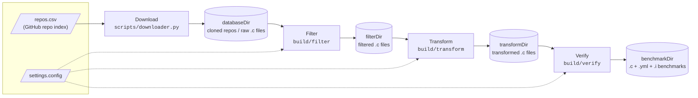
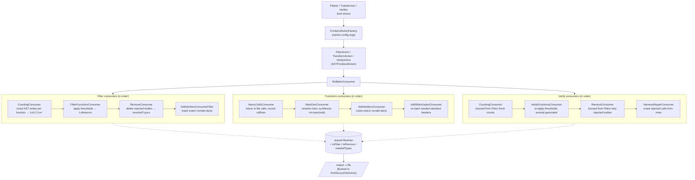

<!--
SPDX-FileCopyrightText: Copyright (C) 2026 The ARG-V Project

SPDX-License-Identifier: Apache-2.0
-->

# ArgV C Transformer - Design

This document is intended to describe the pipeline's design choices, the
trade-offs and roadblocks that motivated them, and what's explicitly unsupported.
For what the pipeline does and how to run it, see [`README.md`](../README.md).

Download, Filter, Transform, and Verify are four separate steps, not one
uniformly-configured pipeline: Download reads its own config
(`downloader.config`) and is never invoked by `argv-c`, while Filter,
Transform, and Verify share `settings.config` via `parsePipelineConfig`
(`src/common/include/ConfigParser.hpp`). See the [Tutorial](tutorial/Tutorial.md)
for a worked example of Download → Filter → Transform on a toy repo.

## Design Choices and Limitations

### Supported Types

Only C builtin primitives have `__VERIFIER_nondet_*` equivalents. The full set (defined in
`VerifierNames.hpp`):

`_Bool`, `char`, `signed char`, `unsigned char`, `short`, `unsigned short`, `int`,
`unsigned int`, `long`, `unsigned long`, `long long`, `unsigned long long`, `float`,
`double`

Types outside this set (pointers, structs, unions, enums, typedefs to non-builtins) are
currently **unsupported for parameter synthesis**. Functions with any unsupported parameter type
cannot be called in the generated harness and have their bodies stripped during filtering.

### Intraprocedural by Design

Each function body is made self-contained: calls to other functions *in the same file*
are replaced with nondeterministic values (havocked). This means the benchmark exercises
each function in isolation; interprocedural reasoning is not tested. Library calls
(C stdlib, system headers) are kept because they have well-known semantics that verifiers
model directly.

### Body-Stripping vs Deletion

Removed functions are body-stripped to bare prototypes (`void f(int x);`), not deleted
entirely. This is intentional: the Transform step's `HavocCallsVisitor` needs the
callee's declaration to resolve its return type when replacing calls. Without the
prototype, the return type would be unknown and the havoc replacement couldn't determine
which `__VERIFIER_nondet_*` variant to use.

### Main Handling

`main` receives special treatment throughout the pipeline:

- **Filter**: subject to the same complexity/feature thresholds as any other function; a
  `main` that doesn't meet them gets body-stripped too. It's exempt only from the
  parameter-type gate, so its `argc`/`argv` pointer params never trigger removal on their
  own.
- **Transform**: renamed to `original_main` and called from a synthesized `main(void)`.
  For `main(int, char**)`, the pointer params have a well-defined contract (unlike an
  arbitrary `void *`), so we synthesize a realistic `argc`/`argv` using havocked C strings
  rather than skipping the function.
- **Verify**: the *generated* `main` is exempt from the threshold re-check (it's harness
  scaffolding, not benchmark content); `original_main` is subject to thresholds like any
  function, but no parameter gate is re-applied, so its `argc`/`argv` never trigger
  removal.
- The `argc` bound (`0–7`) and `argv` string size (`16` bytes) are fixed constants; they
  keep the verifier's state space bounded but are not configurable.

### Pointer Returns in Havocking

When havocking a call that returns a pointer, a raw nondet pointer value cannot be used
(dereferencing an arbitrary address is undefined behavior). Instead, the replacement
allocates a real block via `malloc` and fills it with nondeterministic content
(`__VERIFIER_nondet_memory`). `char *` returns are null-terminated so that string
operations on the result stay in bounds. Function pointer returns are left as-is.

### Include Stripping

The Transform step removes all non-system `#include` directives. Functions declared in
project-local headers are havocked anyway, so the includes only leave unresolvable
references. Standard types that were reaching the file transitively through a stripped
project header are recovered by `AddStdIncludesConsumer`. Files that depend on
*project* types or macros from a local header will still fail to compile after
stripping and are caught by the Verify stage's `keepCompilesOnly` compile check.

An unresolved type isn't always AST-visible for `AddStdIncludesConsumer` to recover: a
local variable declared with an unrecognized type name (e.g. `mode_t m;` with no
`sys/types.h` in scope) causes Clang to drop the whole `DeclStmt`, leaving no node to
walk. `UnknownTypeDiagConsumer` closes this gap by hooking the parser's diagnostics
directly (`err_unknown_typename`, and - the common case for a bare local declaration,
which is syntactically ambiguous with an expression-statement - `err_undeclared_var_use`)
and feeding the recovered names into the same `StdHeaders` lookup, name-only and
backstopped by the same compile check.

### Local Header Resolution

Filter and Transform resolve each file's quoted `#include "..."` directives against a
`HeaderIndex` (`src/common/include/IncludeIndex.hpp`) built once per run over
`databaseDir`, passing matches to Clang as `-I` search paths (`runToolOnFile`'s
`extraIncludeDirs`) so project-local headers actually parse instead of just being
stripped later. Basename collisions across the tree are disambiguated only by rebasing
the include's own subdirectory components onto the candidate directory; a spec with no
subdirectory that still matches more than one candidate just takes the closest one.

### Preprocessor-Gated Code

The pipeline only operates on the **active** preprocessed translation unit. Functions inside
inactive `#ifdef` blocks (e.g. `#ifdef REDIS_TEST`) are invisible to all AST passes:
they are neither counted, filtered, havocked, nor harnessed. They pass through unchanged
as raw text.

### Empty Benchmark Discard

A benchmark whose generated `main` calls no functions is unconditionally deleted. This
happens at two points: Transform does an early post-write text check coupled to
`MainGenConsumer`'s generated-main format string (the exact verbatim empty main
`int main(void) {\n  return 0;\n}`), and Verify does a structural recount after harness
repair: the text check can't work there, because repaired calls leave `;` statements
behind, so `HarnessRepairConsumer` counts the surviving harness calls instead and the
benchmark is discarded when that count is zero.

### What Is Not Supported

- **Struct / union / enum parameters**: no `__VERIFIER_nondet_*` equivalent exists for
  aggregate types, so functions with these parameter types are body-stripped and not
  harnessed
- **Variadic functions** (e.g. `printf`-style): skipped with a warning; no way to
  synthesize a meaningful argument list
- **Aggregate return types**: calls returning structs/unions are left as-is (not havocked),
  since there is no expression-position nondet equivalent
- **Function pointer returns**: calls returning function pointers are left as-is
- **`envp` (third `main` parameter)**: `int main(int, char**, char**)` is not explicitly
  handled; only the first two parameters (`argc`, `argv`) are synthesized
- **Macro-expanded calls**: calls inside macro expansions have no rewritable source range
  and are skipped by the havoc pass
- **K&R-style (old-style) declarations**: the pipeline assumes ANSI-prototyped function
  declarations throughout (parameter typing, the filter's parameter-type gate, and
  `HavocCallsVisitor`'s callee resolution all read from `FunctionDecl::parameters()`).
  Old-style `int f(a, b) int a, b; { ... }` definitions are not explicitly detected or
  special-cased, and their behavior through the pipeline is untested
- **Typedef'd types**: a typedef to a supported builtin (e.g. `typedef int myint`) resolves
  correctly via `getAs<BuiltinType>()`, but a typedef to an unsupported type (e.g.
  `typedef struct foo bar`) is treated as unsupported

## Internal Structure: the Clang AST Pipeline Pattern

Filter, Transform, and Verify share the same Clang tooling skeleton. Each tool wires a
sequence of AST consumers into a `MultiplexConsumer`; all consumers share one `Rewriter`
and communicate through shared state (`toFilter` map, `toRemove` vector, `neededTypes`
set). The Rewriter's edited buffer is flushed to the output file in
`EndSourceFileAction`. Verify deliberately *reuses* Filter's `CountingConsumer` and
`RemoveConsumer` rather than reimplementing them, so the counting and stripping
semantics cannot drift between the two stages.

Verifier nondet naming, suffix→C-type mappings, and the `isVerifierGenerated`
generated-artifact check live in `src/common/include/VerifierNames.hpp`, shared by all
stages.
