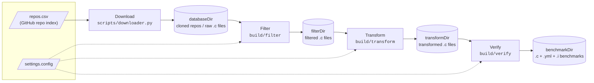
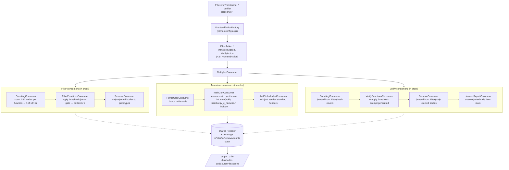

<!--
SPDX-FileCopyrightText: Copyright (C) 2026 The ARG-V Project

SPDX-License-Identifier: Apache-2.0
-->

# ArgV C Transformer - Design

This document is intended to describe the pipeline's design choices, the
trade-offs and roadblocks that motivated them, and what's explicitly unsupported.
For what the pipeline does and how to run it, see [`README.md`](../README.md).

Download, Filter, Transform, and Verify are four separate steps, not one
uniformly-configured pipeline: Download reads its own config
(`downloader.config`) and is never invoked by `argv-c`, while Filter,
Transform, and Verify share `settings.config` via `parsePipelineConfig`
(`src/common/include/ConfigParser.hpp`). See the [Tutorial](tutorial/Tutorial.md)
for a worked example of Download → Filter → Transform on a toy repo.

## Design Choices and Limitations

### Supported Types

Only C builtin primitives have `__VERIFIER_nondet_*` equivalents. The full set (defined in
`VerifierNames.hpp`):

`_Bool`, `char`, `signed char`, `unsigned char`, `short`, `unsigned short`, `int`,
`unsigned int`, `long`, `unsigned long`, `long long`, `unsigned long long`, `float`,
`double`

Types outside this set (structs, unions, enums, typedefs to non-builtins) are
**unsupported for parameter synthesis**. Functions with any unsupported parameter type
cannot be called in the generated harness and have their bodies stripped during filtering.

Pointer parameters are the exception: they are synthesized by allocating a real block
rather than inventing an address, so they are supported whenever `planPointer`
(`src/common/include/HavocPolicy.hpp`) finds a size for the pointee. It does not for
function pointers, pointer-to-pointer, or records containing pointer fields — those stay
unsupported, and a function taking one is body-stripped like any other. The filter gates
on the same classifier the transform uses, so a pointer-param function survives filtering
exactly when the harness can call it.

An integer parameter alongside a pointer parameter is clamped rather than left as a raw
nondet value: `MainGenConsumer::genCallHarness` bounds it with `if (n < 0 || n >
__HAVOC_ARRAY_ELEMS) abort();` (the signedness check dropped for unsigned types). This
sidesteps guessing which parameter is "the length" from its name — every integer is
bounded by the element count of the storage that was actually declared for the pointer
parameters, so a genuinely-undersized block can't be indexed out of bounds regardless of
which parameter the callee treats as a length.

### Pointer Shapes

`planPointer` classifies every pointer or constant-array parameter/return into one
`PointerShape` (`src/common/include/HavocPolicy.hpp`), and `renderPointerStorage` turns a
viable plan into real stack storage for both a parameter or a hoisted return, so
the two call sites can't drift:

- **`CString`** : (`char*`/pointee is any character type) → `char b[__HAVOC_STR_MAX]`,
  filled and null-terminated in bounds by `__havoc_cstring_fill`.
- **`Array`** : a parameter spelled `T[N]`. `ParmVarDecl::getOriginalType()` preserves the
  pre-decay `ConstantArrayType`, so storage uses the declared bound `N` exactly rather than
  a generic size.
- **`Block`** : any other pointer to a sized type, no declared bound available →
  `T b[__HAVOC_ARRAY_ELEMS]`.
- **`Record`** : a struct/union pointee with a definition, viable only when
  `recordHasPointerFields` finds no pointer anywhere in it (transitively). A block filled
  by `__VERIFIER_nondet_memory` would otherwise leave pointer-typed bytes the callee could
  dereference. Not viable means the function isn't harnessed.
- **`Opaque`** : `void*`, an incomplete type, or a record whose definition isn't in the
  main file → `unsigned char b[__HAVOC_BLOCK_MAX]`, cast to the declared pointer type.
- **`Function`** : never viable; no value can be synthesized for a function pointer.

Every shape (besides `Function`) fills its storage with `__VERIFIER_nondet_memory`, so
there's no heap and no `free` obligation, and its declared element count bounds whatever
indexing the callee does into it.

A struct or union tag first named inside a parameter list (`void f(struct Rect *r)`) has
*prototype scope*, invisible outside that declaration, so a harness cast to it would
name a distinct, incompatible type and fail to compile. `pointeeFwdDecl` detects this and
emits a file-scope forward declaration (`struct Rect;`), collected into a set shared by
`HavocCallsConsumer` (havocked pointer returns) and `MainGenConsumer` (harnessed pointer
parameters); `MainGenConsumer` writes the whole set into the file's prelude once every
call is known, since it runs last of the two. A repeated forward declaration is legal C
even when a full definition follows.

### Intraprocedural by Design

Each function body is made self-contained: calls to other functions *in the same file*
are replaced with nondeterministic values (havocked). This means the benchmark exercises
each function in isolation; interprocedural reasoning is not tested. Library calls
(C stdlib, system headers) are kept because they have well-known semantics that verifiers
model directly.

### Body-Stripping vs Deletion

Removed functions are body-stripped to bare prototypes (`void f(int x);`), not deleted
entirely. This is intentional: the Transform step's `HavocCallsVisitor` needs the
callee's declaration to resolve its return type when replacing calls. Without the
prototype, the return type would be unknown and the havoc replacement couldn't determine
which `__VERIFIER_nondet_*` variant to use.

### Main Handling

`main` receives special treatment throughout the pipeline:

- **Filter**: subject to the same complexity/feature thresholds as any other function; a
  `main` that doesn't meet them gets body-stripped too. It's exempt only from the
  parameter-type gate, so its `argc`/`argv` pointer params never trigger removal on their
  own.
- **Transform**: renamed to `original_main` and called from a synthesized `main(void)`.
  For `main(int, char**)`, the pointer params have a well-defined contract (unlike an
  arbitrary `void *`), so we synthesize a realistic `argc`/`argv` using havocked C strings
  rather than skipping the function.
- **Verify**: the *generated* `main` is exempt from the threshold re-check (it's harness
  scaffolding, not benchmark content); `original_main` is subject to thresholds like any
  function, but no parameter gate is re-applied, so its `argc`/`argv` never trigger
  removal.
- The `argc` bound (default `1–4`) and `argv` string size (default `16` bytes) keep the
  verifier's state space bounded. They are emitted into each benchmark as the
  `__HAVOC_ARGC_MIN` / `__HAVOC_ARGC_MAX` / `__HAVOC_STR_MAX` macros rather than inlined
  as literals, so a generated benchmark can be retuned without rerunning the pipeline;
  the values come from `[Havoc Settings]` in the config, falling back to the constants in
  `src/common/include/HavocPolicy.hpp`.

### Pointer Returns in Havocking

When havocking a call that returns a pointer, a raw nondet pointer value cannot be used
(dereferencing an arbitrary address is undefined behavior). Instead, `HavocCallsVisitor`
runs the return type through the same `planPointer`/`renderPointerStorage` pair the
harness uses for parameters (see "Pointer Shapes" above), hoisting a uniquely-named stack
buffer declaration above the call's enclosing statement so it outlives the call, and
replacing the call with a plain-C reference to that storage. No heap, so no `free`
obligation. A non-viable plan (function pointer, pointer-to-pointer, a record with
pointer fields) is left as-is, and a pointer return whose value is discarded is dropped.

### Cleaning Up After Havocking

Havocking hollows statements out: `helper();` becomes a bare nondet call, and a
loop whose body and increment were both calls now spins on nothing — the
transform would have *manufactured* nontermination the source didn't have. Such
residue is erased, but only under a deliberately narrow rule:

> A statement is removed if it is side-effect-free **and** contains a call this
> run havocked.

The second condition is the important one. Without it the pass becomes a
dead-code eliminator, and a benchmark would diff against upstream in places
havocking never touched. Pure-but-untouched code stays exactly as written.

A havocked call counts as side-effect-free because the transform is
intraprocedural: the callee's writes to globals and out-parameters are discarded
already, so the call contributes only its return value. Calls that are *not*
havocked (library calls, aggregate returns, non-viable pointer plans) remain
side-effecting and block removal.

Because a statement can be erased after its inner calls were rewritten, verifier
declarations are decided only once traversal ends — otherwise an erased call
would leave a dangling `extern` that no compiler warning would catch.

### Include Stripping

> **Superseded in design, current in code.** Everything below describes what the
> pipeline does today: delete local includes, then reconstruct what they contained.
> That direction is what makes each fix expose the next failure class (types →
> macros → struct layouts). The replacement is to inline local headers by value
> instead - see [`HeaderClosure.md`](./HeaderClosure.md). Read this section as the
> record of the problem, not the intended end state.

The Transform step removes all non-system `#include` directives. Functions declared in
project-local headers are havocked anyway, so the includes only leave unresolvable
references. Standard types that were reaching the file transitively through a stripped
project header are recovered by `AddStdIncludesConsumer`. Files that depend on
*project* types or macros from a local header will still fail to compile after
stripping and are caught by the Verify stage's `keepCompilesOnly` compile check.

An unresolved type isn't always AST-visible for `AddStdIncludesConsumer` to recover: a
local variable declared with an unrecognized type name (e.g. `mode_t m;` with no
`sys/types.h` in scope) causes Clang to drop the whole `DeclStmt`, leaving no node to
walk. This is patched by `UnknownTypeDiagConsumer`, which scrapes names out of the
parser's diagnostics. Header closure has **demoted, not replaced** it: closure inlines
local headers in the filter stage, so where a local header is involved the type now has
a real `Decl` and closure wins by running first. The diagnostic path remains for the two
cases closure cannot reach — a standard type used with no header included at all, and
any file where closure itself fails. See
[`DiagnosticsHandoff.md`](./DiagnosticsHandoff.md).

### Local Header Resolution

Filter and Transform resolve each file's quoted `#include "..."` directives against a
`HeaderIndex` (`src/common/include/IncludeIndex.hpp`) built once per run over
`databaseDir`, passing matches to Clang as `-I` search paths (`runToolOnFile`'s
`extraIncludeDirs`) so project-local headers actually parse instead of just being
stripped later. Basename collisions across the tree are disambiguated only by rebasing
the include's own subdirectory components onto the candidate directory; a spec with no
subdirectory that still matches more than one candidate just takes the closest one.

### Preprocessing Late, Not Early

The pipeline preprocesses **once, at the very end** (`Verifier::preprocess`, `-E -P
-std=gnu11`), and every stage before that operates on real source with its `#include`
directives intact. Running `clang -E` up front instead - after Filter, before Transform -
is deliberately declined, but the cost of declining is substantial and is recorded here
honestly so the tradeoff can be re-evaluated as the corpus changes.

**What early preprocessing would buy.** Not just macro expansion - essentially the whole
include- and type-recovery apparatus exists only because project headers get stripped:

| mechanism | lines |
|---|---|
| `StdHeaders.hpp` (hand-maintained type→header registry) | 474 |
| `AddStdIncludesConsumer` (.cpp + .hpp) | 206 |
| `UnknownTypeDiagConsumer` (.cpp + .hpp) | 91 |
| `HeaderClosure` (.cpp + .hpp) | ~640 |
| `IncludeFinder` (in `TransformAction.cpp`) | ~40 |
| `pointeeFwdDecl` + the Opaque branch of `planPointer` | ~35 |
| **total** | **~1486** |

(`HeaderClosure` was *added* to this table, not swapped in — `UnknownTypeDiagConsumer`
is retained beneath it as a fallback. Declining early preprocessing therefore got
~640 lines more expensive by this measure, not less.)

(`IncludeIndex.hpp`'s `-I` resolution survives either way - it is what makes `-E` runnable
at all.)

Deleted volume is the least of it. Three sharper points:

- **It replaces guessing with ground truth.** ~~`StdHeaders.hpp` is a hand-curated registry
  that can never be complete, and `UnknownTypeDiagConsumer` matches unresolved names
  *by string* with no Decl to validate against.~~ **Largely answered by header closure**,
  which works from real `Decl`s and real source spellings; `StdHeaders.hpp` is now only
  the fallback for un-includable internal headers, and `UnknownTypeDiagConsumer` only
  the fallback for files closure does not reach. What early preprocessing would still
  buy over closure is macro *expansion* — closure re-emits macros but does not expand
  them, so calls hidden inside one still escape havocking.
- **It closes failures currently documented as unrecoverable.** See
  [`DiagnosticsHandoff.md`](./DiagnosticsHandoff.md): an unresolved type in a local
  declaration drops the whole `DeclStmt` from the AST with no node to walk; in a
  parameter, field, or global the type is substituted with `int` and the spelled name is
  lost; and `foo_t x = mystery_func();` abandons the entire declarator *including the
  call in the initializer*, with no diagnostic and no AST node. All three exist only
  because the definition is absent.
- **It costs benchmark precision, not just code.** A struct defined in a project header
  is havocked as `__HAVOC_OPAQUE_BYTES` (an arbitrary flat byte count) because
  `isInMainFile` fails on its definition. With the definition present it would size
  exactly: `sizeof(T) * __HAVOC_ARRAY_ELEMS`. Every header-defined struct in the corpus
  is currently over- or under-allocated.

It is declined anyway, on the two grounds below. Note what is *not* among them: that the
current mechanisms already exist is not a reason to keep them. The ~845 lines are evidence
that the alternative is simpler, which argues *for* it, not against.

**1. Lossy steps belong downstream of everything that reasons about the input.**
`clang -E` is lossy and host-dependent. See "CBMC `_FloatNN` typedef conflict" below:
preprocessing at the *end* of the pipeline was by itself enough to break ~66% of CBMC
runs, because `-E` inlined glibc's fallback `_FloatNN` typedefs into the `.i`. That was
repairable exactly because it happens last - the noise lands in a terminal artifact with
no dependents and can be stripped after the fact by a regex helper. Preprocess up front
and the same host-specific text becomes what Transform parses and rewrites; post-hoc
stripping is then unsound, because the output may depend on what was stripped. A
preprocessed file also silently freezes every `#ifdef __WORDSIZE`-style choice with no
record that it did (those macros are consumed and erased, not emitted), so the benchmark
encodes the generating host.

Precisely: early `-E` does not add host-specific text to what the *verifier* consumes -
the `.yml` already points at the `.i`, so that text is there today either way. What
changes is whether the lossy step has dependents.

**2. The `.c` remains the auditable artifact.** The solver reads the `.i`; a person reads
the `.c`. Early `-E` makes it ~850 lines of inlined headers around a few lines of real
code. For a generator whose output is meant to be inspected and trusted, that is a
product loss, and it is independent of ground 1.

Two arguments that are often raised here and should **not** be:

- **Implementation difficulty is not a real objection.** Clang's `SourceManager` honours
  `# N "file"` linemarkers for `isInMainFile` itself, so `clang -E` *with* markers already
  excludes header functions from harnessing and havocking with no code change at all; only
  `-E -P` pulls them in. Some rework would remain (a preamble-anchor fix, and disabling
  include re-injection, which collides with already-expanded text:
  `typedef redefinition with different types ('struct __fsid_t' vs ...)`), but it is
  small, and smaller than what it deletes.
- **It is not an AST-cost tradeoff.** 40 files through Transform alone: source with
  includes intact 1639 ms, equivalent `.i` 1637 ms. Clang already parses every header
  declaration either way; `-E` changes where the bytes come from, not how much is parsed.
  Disk grows ~6x.

One genuine secondary cost: the inlined code would be dead weight. `HavocCallsVisitor`
treats header `static inline` functions as in-file and havocs every call into them, so the
bulk of an inlined file becomes unreachable.

**This decision is cheap to reverse** - a flag change plus deleting code, with no format
or data migration. The trigger to revisit is corpus evidence that unresolved-type discards
are a material fraction of losses, or the interprocedural work below, which needs real
definitions regardless.

**What declining costs, restated plainly.** Macros are only the most visible gap. The
include and type-recovery mechanisms above are kept, and with them their residual failure
modes: types that resolve by string-matching rather than by Decl, the unrecoverable
dropped-declarator cases in [`DiagnosticsHandoff.md`](./DiagnosticsHandoff.md), and
`__HAVOC_OPAQUE_BYTES` standing in for every header-defined struct. Those are accepted
because they fail *safe* - a wrong guess yields a file that does not compile and is
discarded by `keepCompilesOnly`, rather than a benchmark that verifies incorrectly. The
macro gap is the one that does not fail safe, which is why it is being closed directly
([`HeaderClosure.md`](./HeaderClosure.md)) rather than by preprocessing early.

### Preprocessor-Gated Code

The pipeline only operates on the **active** preprocessed translation unit. Functions inside
inactive `#ifdef` blocks (e.g. `#ifdef REDIS_TEST`) are invisible to all AST passes:
they are neither counted, filtered, havocked, nor harnessed. They pass through unchanged
as raw text.

### Assert Rewriting and Property Selection

Transform installs a second `PPCallbacks` hook alongside `IncludeFinder`: `AssertRewriter`
(`src/transform/include/TransformAction.hpp`, implemented in `TransformAction.cpp`) rewrites
every `assert(cond)` invocation in the main file into `if (!(cond)) reach_error();`. It
fires on `MacroExpands`, checks the expanded macro is function-like and named `assert`, and
re-lexes the invocation's own source text to pull `cond` out from between the first `(` and
the last `)` — no AST node for the call exists yet at that point in the pipeline, so there
is nothing to rewrite from except the raw text. `reach_error` itself is defined
unconditionally in `argv_c_harness.h` as `void reach_error(void) { assert(0); }`; that
`assert` is never touched because it lives outside the main file, so there's no
self-rewriting loop.

SV-Comp's `unreach-call.prp` is checked as `LTL(G ! call(reach_error()))` — a property over
calls to a function with that literal name, not over `assert` or any C-level "reachability"
concept the verifier understands natively. Rewriting `assert` into `reach_error` is what
makes a benchmark's assertions visible to that check at all.

`CountingConsumer`'s `CountingVisitor` (reused unmodified between Filter and Verify) detects
a call to `reach_error` and records a bare `reach_error` key in the counts map via
`try_emplace` — deliberately excluded from every other count, alongside nondet/havoc-helper
calls, so it doesn't skew a function's own metrics. `Verifier::selectProperties`
(`src/verify/Verifier.cpp`) reads the *post-transform* counts — the same map
`VerifyFunctionsConsumer` used for the threshold re-check — and picks `.prp` files by
structural signal, independent of the reach_error check:

- `reach_error` present in counts → `unreach-call.prp`
- any function with `ForLoops` or `WhileLoops` → `termination.prp`
- any function with `Operations` (a side-effecting op on a signed type) → `no-overflow.prp`
- any function with `PointerDeref`, `MemAlloc`, or `MemFree` → `valid-memsafety.prp` (one
  file bundling the deref/free/memtrack CHECKs)

The loop over functions exits early once loops, integer arithmetic, and memory-safety have
each matched once — the reach_error check runs separately up front, so it isn't part of
that short-circuit. `writeBenchmarkTask` then emits the `.yml`: each selected property as an
`expected_verdict: true` block (a generated benchmark is never a deliberately-planted-bug
one, so every selected property is asserted to hold), pointing at `../properties/<name>.prp`
relative to `benchmarkDir`. An empty property list still produces a valid `.yml` (`properties:
[]`) but logs a warning, since a benchmark nothing was selected for is unlikely to be useful
to a verifier run.

### Empty Benchmark Discard

A benchmark whose generated `main` calls no functions is unconditionally deleted. Both
Transform and Verify check for this with the same text-based `harnessIsEmpty`
(`src/common/include/ClangToolUtils.hpp`): it looks for the exact verbatim empty main
`int main(void) {\n  return 0;\n}` in the written output. This works after Verify's
`HarnessRepairConsumer` too, because it erases a whole line per rejected call (indent,
call, semicolon, trailing newline) rather than leaving a bare `;` behind, so a `main`
emptied by repair collapses back to that same verbatim text.

### What Is Not Supported

- **Struct / union / enum parameters passed by value**: no `__VERIFIER_nondet_*`
  equivalent exists for aggregate types, so functions with these parameter types are
  body-stripped and not harnessed. A pointer *to* a struct/union is a separate case — see
  "Pointer Shapes" above — and is supported when the pointee has no pointer fields
- **Variadic functions** (e.g. `printf`-style): skipped with a warning; no way to
  synthesize a meaningful argument list
- **Aggregate return types**: calls returning structs/unions are left as-is (not havocked),
  since there is no expression-position nondet equivalent
- **Function pointer returns**: calls returning function pointers are left as-is
- **`envp` (third `main` parameter)**: `int main(int, char**, char**)` is not explicitly
  handled; only the first two parameters (`argc`, `argv`) are synthesized
- **Exact sizing of header-defined structs**: a struct whose definition came from a
  stripped project header is havocked as a flat `__HAVOC_OPAQUE_BYTES` block, never
  `sizeof(T)`. `pointeeFwdDecl` solves only the *naming* half of this - it emits an
  incomplete `typedef struct __havoc_T T;` so the harness cast compiles, which is
  sufficient precisely because the size is never taken. Sizing exactly would require
  re-emitting the full definition, and therefore transitive closure over its field types.
  Two things to know before attempting it:
  - If the struct is larger than `__HAVOC_OPAQUE_BYTES`, the callee writes past the block
    and a memory-safety verifier reports a violation that is an artifact of the harness.
    Mitigable today without code changes: `havocOpaqueBytes` is emitted as a macro, so a
    benchmark can be retuned in place.
  - Completing these types would *reduce* coverage. The Opaque branch returns
    `viable = true` before reaching `recordHasPointerFields`, so an opaque record is
    currently harnessed by accident of being unsized; complete it and any struct with a
    pointer field becomes non-viable. Sizing and viability have to be decided separately,
    and full precision here waits on recursive field initialization
- **Macro-expanded calls**: calls inside macro expansions have no rewritable source range
  and are skipped by the havoc pass. This holds for macros defined in the `.c` itself, not
  just headers, and it fails safe - the benchmark compiles and simply is not
  intraprocedural, with nothing diagnosing it. Addressing this needs expansion, not
  `#define` re-emission; see "Macro expansion" in [`HeaderClosure.md`](./HeaderClosure.md)
- **Macros from stripped headers**: a use of a macro defined in a project-local header
  (e.g. `char buf[BUFSIZE];`) becomes an undeclared identifier once the include is
  stripped, and the benchmark is discarded by `keepCompilesOnly`. Planned fix:
  inline them instead, per [`HeaderClosure.md`](./HeaderClosure.md)
- **K&R-style (old-style) declarations**: the pipeline assumes ANSI-prototyped function
  declarations throughout (parameter typing, the filter's parameter-type gate, and
  `HavocCallsVisitor`'s callee resolution all read from `FunctionDecl::parameters()`).
  Old-style `int f(a, b) int a, b; { ... }` definitions are not explicitly detected or
  special-cased, and their behavior through the pipeline is untested
- **Typedef'd types**: a typedef to a supported builtin (e.g. `typedef int myint`) resolves
  correctly via `getAs<BuiltinType>()`, but a typedef to an unsupported type (e.g.
  `typedef struct foo bar`) is treated as unsupported

## Internal Structure: the Clang AST Pipeline Pattern

Filter, Transform, and Verify share the same Clang tooling skeleton. Each tool wires a
sequence of AST consumers into a `MultiplexConsumer`; all consumers share one `Rewriter`
and communicate through shared state passed into each consumer's constructor (Filter's
`toFilter` map and `toRemove` vector; Verify's `counts` map and its own `toRemove`).
The Rewriter's edited buffer is flushed to the output file in `EndSourceFileAction`.
Verify deliberately *reuses* Filter's `CountingConsumer` and `RemoveConsumer` rather than
reimplementing them, so the counting and stripping semantics cannot drift between the two
stages.

Verifier nondet naming, suffix→C-type mappings, and the `isVerifierGenerated`
generated-artifact check live in `src/common/include/VerifierNames.hpp`, shared by all
stages.
